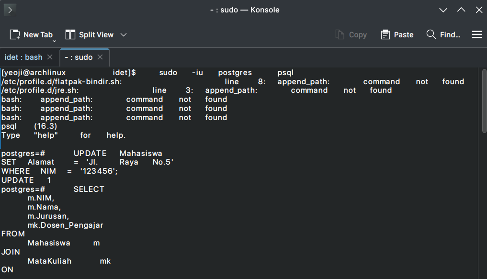
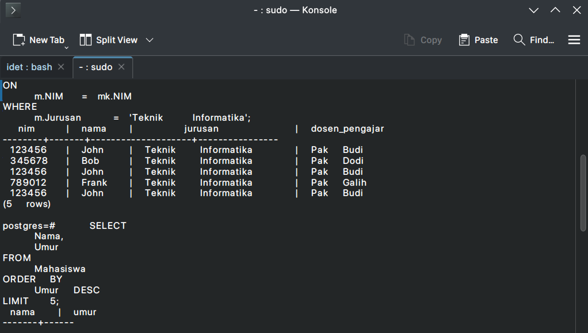
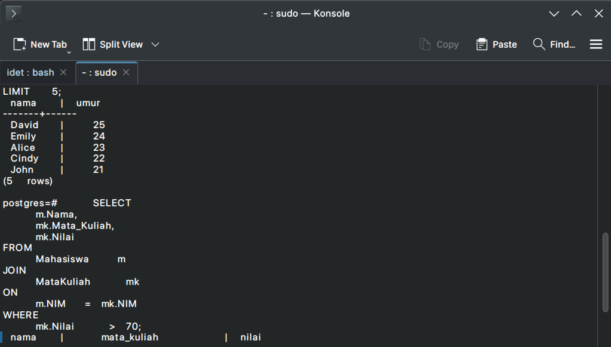
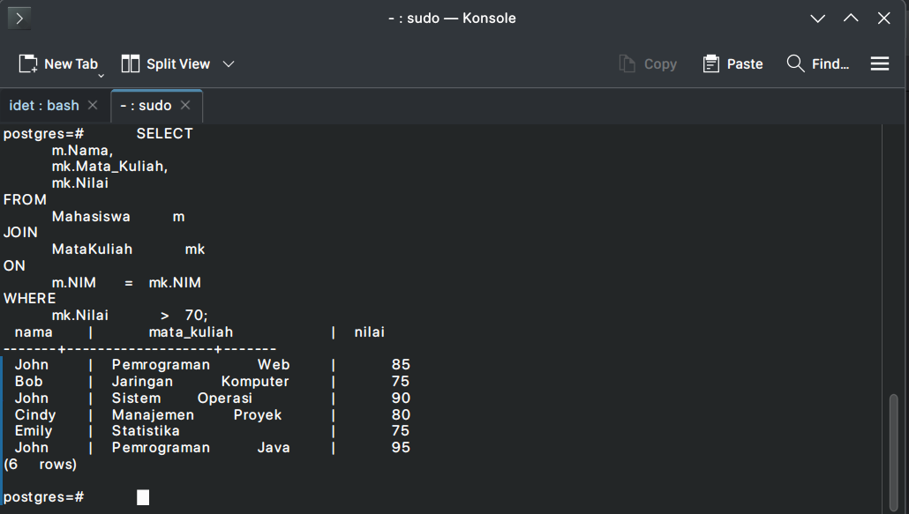

# Database Project

This project demonstrates the following database operations:

## 1. Update alamat mahasiswa

**Problem:** Update alamat mahasiswa with NIM ‘123456’ menjadi ‘Jl. Raya No.5’.

## 2. Tampilkan NIM, nama, dan jurusan mahasiswa

**Problem:** Tampilkan NIM, nama, dan jurusan dari mahasiswa yang memiliki jurusan ‘Teknik Informatika’, serta tampilkan juga nama dosen pembimbingnya.

## 3. Tampilkan 5 nama mahasiswa dengan umur tertua

**Problem:** Tampilkan 5 nama mahasiswa dengan umur tertua.

## 4. Tampilkan nama mahasiswa, mata kuliah, dan nilai

**Problem:** Tampilkan nama mahasiswa, mata kuliah yang diambil, dan nilai yang diperoleh untuk setiap mata kuliah. Hanya tampilkan data mahasiswa yang memiliki nilai lebih bagus dari 70.

